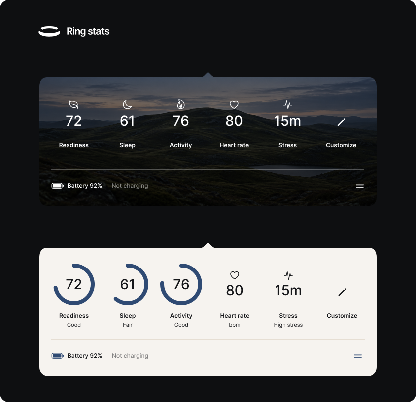

<p align="center">
  
</p>

<p align="center">
  <a href="https://github.com/PetriLahdelma/ring-stats/actions/workflows/ci.yml"></a>
  
  
  <a href="LICENSE"></a>
  <a href="https://github.com/PetriLahdelma/ring-stats/releases/latest"></a>
  <a href="https://github.com/PetriLahdelma/ring-stats/releases"></a>
</p>

# Ring Stats

Ring Stats is an independent, open-source macOS menu-bar viewer for personal
wellness data retrieved through the official Oura API. It keeps the interface
small: selected daily metrics, ring battery status, and local appearance and
ordering controls.

Ring Stats is not affiliated with, authorized, sponsored, or endorsed by Oura
Health Oy or its affiliates. Oura and Oura Ring are third-party trademarks.

## Download

Download the latest Developer ID-signed and Apple-notarized universal DMG from
[GitHub Releases](https://github.com/PetriLahdelma/ring-stats/releases/latest).
The release includes a SHA-256 checksum. Ring Stats requires macOS 14 or later
and uses bring-your-own Oura developer credentials.

## Themes

Choose between the photographic Landscape treatment and the warm, minimal
Ring Stats theme. Both present the same configurable metrics and battery state.

<p align="center">
  
</p>

## Features

- Native SwiftUI/AppKit menu-bar application with no Dock icon.
- Readiness, Sleep, Activity, Heart Rate, Stress, optional Resilience, and ring
  battery status.
- Reorder and hide visible metrics, and resize the popover horizontally.
- Two independent visual treatments, including a project-owned landscape.
- Bring-your-own OAuth application credentials; no shared Client Secret.
- Credentials and tokens stored in macOS Keychain.
- Health API responses kept in memory rather than written to a local database.
- No analytics, advertising, telemetry, or third-party runtime dependencies.

## Requirements

- macOS 14 or later.
- Xcode 26 or another toolchain supporting Swift tools version 6.2.
- An Oura account with API access and an application created in the
  [Oura developer portal](https://developer.ouraring.com/applications).

Access to Oura data remains subject to Oura's current API agreement, account
requirements, permissions, and service availability.

Before publicly announcing or distributing an integration, review the current
[Oura API and MCP Agreement](https://cloud.ouraring.com/legal/api-agreement)
and obtain any written consent it requires. The repository's open-source
license does not grant access to Oura services or override their terms.

## Connect an account

1. Create your own application in the Oura developer portal.
2. Register this redirect URI exactly:

   ```text
   http://localhost:43828/oauth/callback
   ```

3. Launch Ring Stats, open Connection settings, and enter your Client ID and
   Client Secret.
4. Complete Oura's browser-based consent flow.

The app requests the `daily`, `heartrate`, `stress`, and
`ring_configuration` scopes. Grant only the permissions you want to use.

Never post a Client Secret in an issue, commit it to a repository, or include
it in a distributed application.

## Build and test

```bash
swift test
swift build -Xswiftc -warnings-as-errors
scripts/build_app.sh
open "$HOME/Applications/Ring Stats.app"
```

`scripts/build_app.sh` creates an ad-hoc-signed local build by default. Set
`INSTALL_APP=0` to build without replacing the copy in `~/Applications`:

```bash
INSTALL_APP=0 scripts/build_app.sh
```

The default build targets the current Mac architecture. To create a universal
application, build both supported architectures:

```bash
BUILD_ARCHS="arm64 x86_64" INSTALL_APP=0 scripts/build_app.sh
```

## Create a local DMG

```bash
scripts/create_dmg.sh
```

The disk image is written under `dist/` and contains Ring Stats plus an
Applications shortcut. A local DMG is not an authenticated public release.

## Sign and notarize a release

Public macOS distribution requires an Apple Developer Program membership, a
Developer ID Application certificate, and notarization credentials stored in
Keychain. Store a notary profile once:

```bash
xcrun notarytool store-credentials "ring-stats-notary" \
  --apple-id "YOUR_APPLE_ID" \
  --team-id "YOUR_TEAM_ID" \
  --password "YOUR_APP_SPECIFIC_PASSWORD"
```

Then produce, sign, notarize, and staple the DMG without placing credentials in
the repository or command-line environment:

```bash
APPLE_SIGNING_IDENTITY="Developer ID Application: Your Name (TEAMID)" \
APPLE_NOTARY_PROFILE="ring-stats-notary" \
BUILD_ARCHS="arm64 x86_64" \
scripts/sign_and_notarize.sh
```

The script verifies the application signature, submits the DMG with
`notarytool`, staples the notarization ticket, validates it, and prints a
SHA-256 checksum. See [SECURITY.md](SECURITY.md) for release-integrity notes.

## Privacy and data deletion

Health responses are fetched directly from Oura and kept in memory. OAuth
credentials and tokens remain in macOS Keychain. **Disconnect & Delete Local
Data** revokes the current authorization when possible and removes the locally
stored OAuth secrets. See [PRIVACY.md](PRIVACY.md) for the complete data flow.

## Contributing

Keep changes narrow, add or update tests for behavior changes, and run:

```bash
swift test
swift build -Xswiftc -warnings-as-errors
```

Do not commit personal health data, credentials, signing material, Oura brand
assets, or screenshots containing private information. Security reports should
follow [SECURITY.md](SECURITY.md), not public issues.

See the [product roadmap](ROADMAP.md) for the prioritized path to signed
releases, better reliability, macOS automation, and sustainable funding.

## Legal

- [MIT License](LICENSE)
- [Privacy Policy](PRIVACY.md)
- [Terms of Use](TERMS.md)
- [Security Policy](SECURITY.md)
- [Trademark Policy](TRADEMARKS.md)
- [Notices](NOTICE.md)
- [Roadmap](ROADMAP.md)

This project is a convenience viewer, not a medical device, and does not offer
medical advice.
