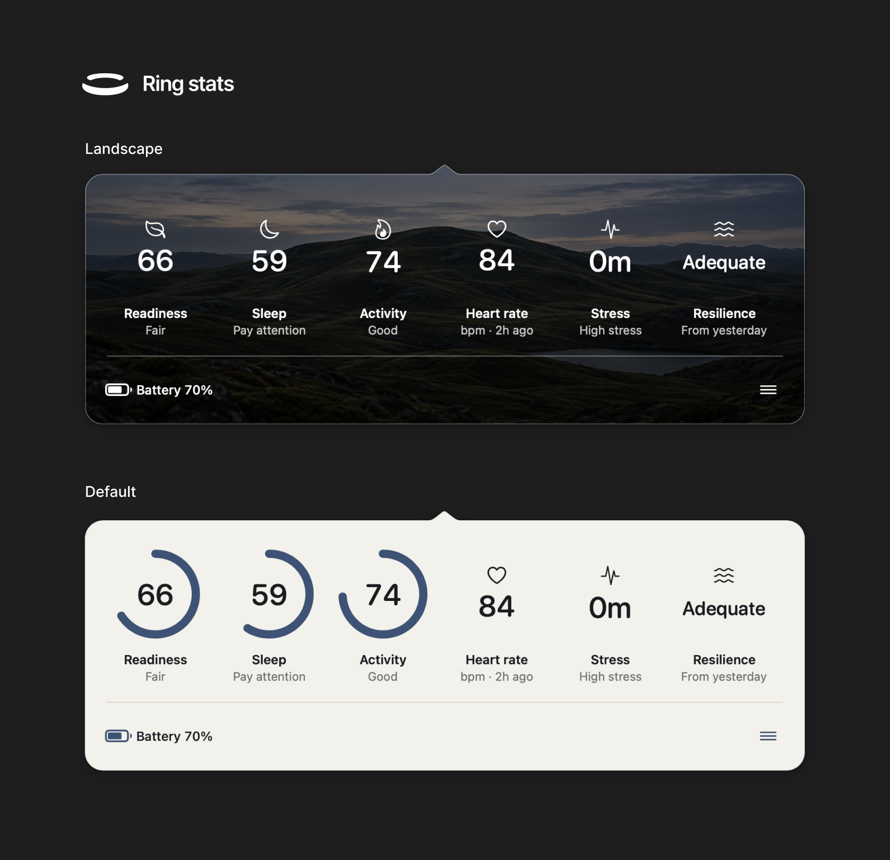

<p align="center">
  <picture>
    <source media="(prefers-color-scheme: dark)" srcset=".github/assets/ring-stats-banner.svg">
    
  </picture>
</p>

<p align="center">
  <a href="https://github.com/PetriLahdelma/ring-stats/actions/workflows/ci.yml"></a>
  
  
  <a href="LICENSE"></a>
  <a href="https://github.com/PetriLahdelma/ring-stats/releases/latest"></a>
  <a href="https://github.com/PetriLahdelma/ring-stats/releases"></a>
</p>

# Ring Stats

Ring Stats is an independent, open-source macOS menu-bar viewer for personal
wellness data retrieved through the official Oura API. It keeps the interface
small: selected daily metrics, ring battery status, and local appearance and
ordering controls.

Ring Stats is not affiliated with, authorized, sponsored, or endorsed by Oura
Health Oy or its affiliates. Oura and Oura Ring are third-party trademarks.

## Download

Download the latest Developer ID-signed and Apple-notarized universal DMG from
[GitHub Releases](https://github.com/PetriLahdelma/ring-stats/releases/latest).
The release includes a SHA-256 checksum. Ring Stats requires macOS 14 or later
and uses bring-your-own Oura developer credentials.

### Install

1. Download the DMG and its `.sha256` file from
   [GitHub Releases](https://github.com/PetriLahdelma/ring-stats/releases/latest).
2. In Terminal, replace `<version>` with the downloaded release number and
   verify the download from the directory containing both files:

   ```bash
   shasum -a 256 -c "Ring-Stats-<version>.dmg.sha256"
   ```

3. Open the DMG and drag **Ring Stats** to **Applications**.
4. Open Ring Stats from Applications. Its split-ring icon appears in the menu
   bar; the app intentionally has no Dock icon.

To update, quit Ring Stats, download the newer signed release, and replace the
copy in Applications. Keychain credentials and interface preferences remain in
place across ordinary updates.

## Themes

Choose between the warm, minimal Ring Stats theme, the photographic Landscape
treatment, and Holographic, black on pastel marbled foil. All three
present the same configurable metrics and battery state.

<p align="center">
  
</p>

## Features

- Native SwiftUI/AppKit menu-bar application with no Dock icon.
- Readiness, Sleep, Activity, Heart Rate, Stress, optional Resilience, and ring
  battery status.
- Reorder and hide visible metrics, and resize the popover horizontally.
- Honest freshness: a stat that fails to refresh keeps its last known value,
  marked "Not updated", and the status line says when data last updated.
- Three themes that show the same information: Ring Stats, a project-owned
  Landscape photograph, and Holographic.
- Guided three-step connection with a Keychain-only credential note.
- Shortcuts actions, "Get Ring Stat" and "Get Ring Battery", which also work
  from Raycast, Alfred, and Stream Deck through Shortcuts. They answer from
  memory and write nothing to disk.
- Background refresh every 30 minutes, less often on battery power, and an
  optional low ring battery notification.
- Text size setting, full keyboard access to the stats row, and App Sandbox
  confinement.
- A local Diagnostics report you can review before sharing; it never contains
  health values, credentials, or tokens.
- Bring-your-own OAuth application credentials; no shared Client Secret.
- Credentials and tokens stored in macOS Keychain.
- Health API responses kept in memory rather than written to a local database.
- No analytics, advertising, telemetry, or third-party runtime dependencies.

## User requirements

- macOS 14 or later.
- An Oura account with API access and an application created in the
  [Oura developer portal](https://developer.ouraring.com/applications).

Building from source additionally requires Xcode 26 or another toolchain that
supports Swift tools version 6.2. Binary users do not need Xcode.

Access to Oura data remains subject to Oura's current API agreement, account
requirements, permissions, and service availability.

Before publicly announcing or distributing an integration, review the current
[Oura API and MCP Agreement](https://cloud.ouraring.com/legal/api-agreement)
and obtain any written consent it requires. The repository's open-source
license does not grant access to Oura services or override their terms.

## Connect an account

1. Create your own application in the Oura developer portal.
2. Register this redirect URI exactly:

   ```text
   http://127.0.0.1:43828/oauth/callback
   ```

3. Launch Ring Stats. Connection opens on first launch and walks through the
   same steps: create the application, add the callback, then enter your
   Client ID and Client Secret.
4. Complete Oura's browser-based consent flow. Ring Stats confirms the secure
   connection and opens the popover.

Ring Stats derives authorization scopes from the statistics currently enabled
in Appearance. Battery status always requires `ring_configuration`; the other
possible scopes are `daily`, `heartrate`, and `stress`. The default visible set
uses all four. Hidden statistics are not fetched, although permissions already
granted to an existing token remain granted until you revoke or reauthorize it.

Never post a Client Secret in an issue, commit it to a repository, or include
it in a distributed application.

## Build and test

```bash
swift test -Xswiftc -warnings-as-errors
BUILD_ARCHS="arm64 x86_64" scripts/build_app.sh
open "dist/Ring Stats.app"
```

`swift test` also renders every popover state in both themes and all
supported widths, plus each onboarding step, into `.build/state-gallery/`.
Open `.build/state-gallery/popover/index.html` to review them.

`scripts/build_app.sh` creates an ad-hoc-signed local build, retained dSYM, and
tree-bound candidate manifest under `dist/`; it does not install by default.
To install under `~/Applications`, opt in explicitly:

```bash
INSTALL_APP=1 scripts/build_app.sh
```

Installation quits only the app with Ring Stats' bundle identifier, moves any
previous installation to a unique recoverable Trash path, installs and launches
the candidate, and prints that recovery path. It never recursively deletes the
installed bundle.

The default build targets the current Mac architecture. To create a universal
application, build both supported architectures:

```bash
BUILD_ARCHS="arm64 x86_64" INSTALL_APP=0 scripts/build_app.sh
```

## Create a local DMG

```bash
scripts/create_dmg.sh
```

The disk image is written under `dist/` and contains Ring Stats plus an
Applications shortcut. A local DMG is not an authenticated public release.

## Sign and notarize a release

Public macOS distribution requires an Apple Developer Program membership, a
Developer ID Application certificate, and notarization credentials stored in
Keychain. Store a notary profile once:

```bash
xcrun notarytool store-credentials "ring-stats-notary" \
  --apple-id "YOUR_APPLE_ID" \
  --team-id "YOUR_TEAM_ID" \
  --password "YOUR_APP_SPECIFIC_PASSWORD"
```

Then produce, sign, notarize, and staple the DMG without placing credentials in
the repository or command-line environment:

```bash
APPLE_SIGNING_IDENTITY="Developer ID Application: Your Name (TEAMID)" \
APPLE_NOTARY_PROFILE="ring-stats-notary" \
BUILD_ARCHS="arm64 x86_64" \
scripts/sign_and_notarize.sh
```

The script verifies the application signature, submits the DMG with
`notarytool`, staples the notarization ticket, validates it, and prints a
SHA-256 checksum. See [SECURITY.md](SECURITY.md) for release-integrity notes.

## Refresh and data freshness

Opening the popover requests a refresh when the last successful snapshot is
more than five minutes old. **Refresh Now** bypasses that interval. The footer
shows the last successful update time; when a refresh fails, Ring Stats keeps
the prior values visible and marks them as stale instead of replacing them with
empty data. Daily values identify an older source day, and Heart Rate shows the
age of the latest sample.

## Privacy, disconnect, and uninstall

Health responses are fetched directly from Oura and kept in memory. OAuth
credentials and tokens remain in macOS Keychain. **Disconnect & Delete Local
Data** revokes the current authorization when possible and removes the locally
stored OAuth secrets. See [PRIVACY.md](PRIVACY.md) for the complete data flow.

Before uninstalling, open **Connection** from the popover menu or the menu-bar
icon's context menu and choose **Disconnect & Delete Local Data**. Then quit
Ring Stats and move it from Applications to the Trash. Removing only the app
does **not** revoke Oura authorization, remove Keychain items, or delete local
preferences. If the app cannot run, revoke access through Oura and remove the
Ring Stats generic-password items in Keychain Access. Optional display
preferences can be removed with:

```bash
defaults delete com.digitaltableteur.ringstats
```

See [PRIVACY.md](PRIVACY.md) for migration and deletion details.

## Troubleshooting

- **Authorization never returns:** confirm the registered redirect is exactly
  `http://127.0.0.1:43828/oauth/callback`; `localhost` is not interchangeable.
- **A statistic says permission is required:** enable it in Appearance, then
  choose **Reauthorize Permissions**.
- **Values are old:** check the per-value date/time and footer update label,
  then choose **Refresh Now**. Oura may publish today's daily values later.
- **Authorization expired:** open **Connection** and reauthorize. Existing
  values remain visible but are marked stale until a refresh succeeds.
- **Saved credentials cannot be read:** open **Connection** and follow the
  displayed Keychain error. Do not post credentials in a public issue.

## Contributing

Keep changes narrow, add or update tests for behavior changes, and run:

```bash
swift test
swift build -Xswiftc -warnings-as-errors
```

Do not commit personal health data, credentials, signing material, Oura brand
assets, or screenshots containing private information. Security reports should
follow [SECURITY.md](SECURITY.md), not public issues.

See [CONTRIBUTING.md](CONTRIBUTING.md) for the verified development workflow,
[ARCHITECTURE.md](ARCHITECTURE.md) for system boundaries, and
[ROADMAP.md](ROADMAP.md) for planned work.

## Legal

- [MIT License](LICENSE)
- [Privacy Policy](PRIVACY.md)
- [Terms of Use](TERMS.md)
- [Security Policy](SECURITY.md)
- [Trademark Policy](TRADEMARKS.md)
- [Notices](NOTICE.md)
- [Roadmap](ROADMAP.md)
- [Architecture](ARCHITECTURE.md)
- [Asset provenance](ASSETS.md)
- [Changelog](CHANGELOG.md)
- [Contributing](CONTRIBUTING.md)
- [Release process](RELEASING.md)

This project is a convenience viewer, not a medical device, and does not offer
medical advice.
