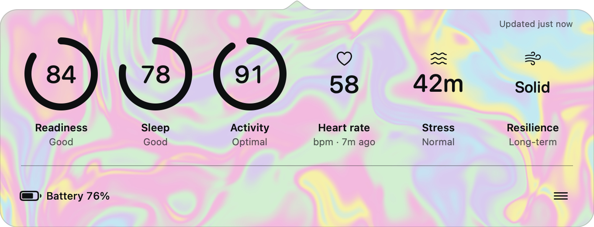
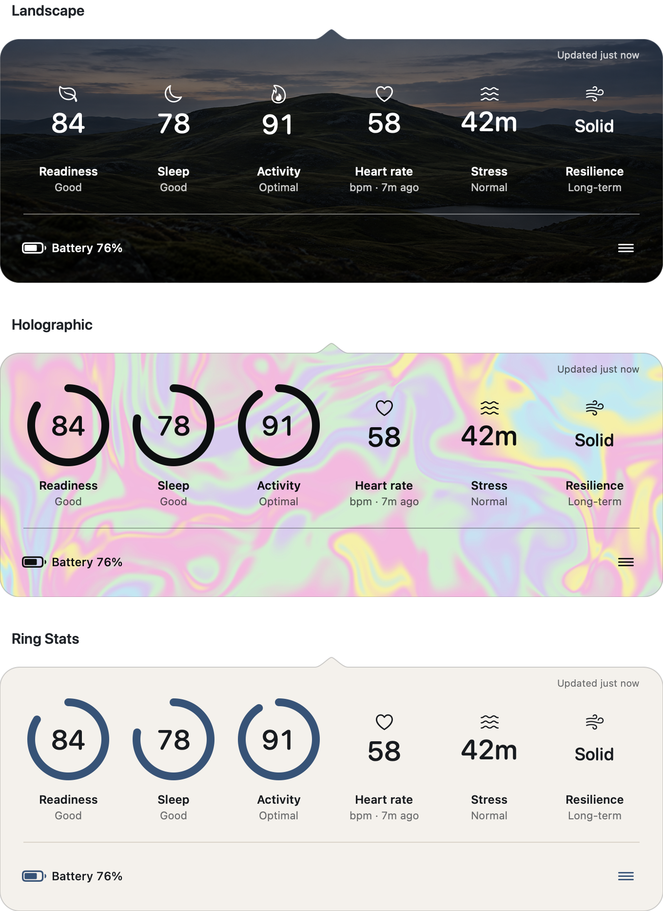

<p align="center">
  
</p>

# Ring Stats

**Your Oura scores in the Mac menu bar.** Readiness, Sleep, Activity, heart
rate, Stress, Resilience, and the ring battery, one click away. Oura makes no
Mac app. Ring Stats is a native one with no server of its own: your data goes
from Oura to your Mac and nowhere else.

<p align="center">
  <a href="https://github.com/PetriLahdelma/ring-stats/releases/latest"></a>
  
  
  <a href="LICENSE"></a>
</p>

<p align="center">
  <a href="https://github.com/PetriLahdelma/ring-stats/releases/latest"><b>Download the DMG</b></a>
  &nbsp;·&nbsp;
  <a href="#connect-in-two-minutes">How it connects (2 min)</a>
  &nbsp;·&nbsp;
  <a href="https://github.com/PetriLahdelma/ring-stats/subscription">Watch releases for updates</a>
</p>

*Ring Stats is an independent open-source project, not affiliated with or
endorsed by Oura Health Oy. Oura and Oura Ring are trademarks of Oura Health Oy.*

## Install

1. Download `Ring-Stats-<version>.dmg` from the
   [latest release](https://github.com/PetriLahdelma/ring-stats/releases/latest).
   It is signed with a Developer ID and notarized by Apple, about 3 MB, and
   runs on Apple silicon and Intel Macs with macOS 14 or later.
2. Open it and drag **Ring Stats** to **Applications**.
3. Open Ring Stats. Its split-ring icon appears in the menu bar; there is no
   Dock icon. The first launch walks you through connecting your Oura account.

A Homebrew cask is prepared in `packaging/homebrew/`; it becomes installable
once the project's tap repository is published.

To update, replace the app in Applications with the newer release; your
connection and settings stay in place. Each release also ships a SHA-256
checksum, a signed attestation, and a provenance archive; see
[SECURITY.md](SECURITY.md) if you want to verify them.

## Supported rings

Ring Stats reads whatever Oura publishes through its API, so it works with any
ring the Oura app syncs, with these limits:

| Ring | Works | Notes |
|---|---|---|
| **Oura Ring 4** | Yes | API access needs an active Oura Membership. |
| **Oura Ring Gen3** (Heritage and Horizon) | Yes | API access needs an active Oura Membership. |
| **Oura Ring Gen2** | Should work | Oura exempts Gen2 rings bought before its membership launched from the membership requirement; Oura decides which. Stress and Resilience are Gen3-and-later features, so those two tiles stay empty; hide them in Appearance. Untested by the maintainer, so please report how it goes. |
| Other brands | Not yet | Oura is the only ring Ring Stats has verified. [research/RING_PROVIDERS.md](research/RING_PROVIDERS.md) tracks the others; Ultrahuman, whose personal API token fits the no-server model, is the one candidate. |

Daily scores appear once the ring has synced with the Oura app on your phone,
usually after you wake up. Ring Stats does not talk to the ring itself.

## Connect in two minutes

Ring Stats connects through an Oura developer application that **you** own.
That is the point: there is no Ring Stats server and no shared secret inside
the app, so your health data travels from Oura to your Mac only, and Oura's
10-user limit on unapproved apps never applies to you. The cost is a free,
one-time, two-minute step that the app walks you through:

1. In the [Oura developer portal](https://developer.ouraring.com/applications),
   create an application. Any name works. Gen3 and Ring 4 need an active
   Oura Membership for API access.
2. Add this redirect URI exactly (use `localhost`, not `127.0.0.1`):

   ```text
   http://localhost:43828/oauth/callback
   ```

3. Paste the application's Client ID and Client Secret into Ring Stats. They
   go into your Mac's Keychain and nowhere else. Your browser opens by itself
   so you can approve access.

Ring Stats asks only for the permissions the stats you show need, and
**Disconnect & Delete Local Data** revokes the authorization and removes the
credentials and tokens from the Keychain.

## What it does

- Shows Readiness, Sleep, Activity, heart rate, Stress, Resilience, and ring
  battery in a popover that fits a five-second glance. Hide, reorder, and
  resize to taste.
- Three themes that show the same information: Ring Stats, Landscape, and
  Holographic. Dark Mode follows macOS.
- Honest about freshness: the status line always says when data last
  updated, a stat that fails to refresh keeps its last value marked with its
  age, and you can retry from the status line.
- Optional value in the menu bar, such as today's Readiness or the battery
  when it is low, so a glance needs no click at all.
- Refreshes in the background every 30 minutes, less often on battery power,
  with an optional notification when the ring battery is low.
- Shortcuts actions, **Get Ring Stat** and **Get Ring Battery**, which also
  work from Raycast, Alfred, and Stream Deck through Shortcuts.
- Full keyboard access, VoiceOver labels, a text size setting, Reduce Motion
  and Increase Contrast support; the rules are in
  [ACCESSIBILITY.md](ACCESSIBILITY.md).
- Nothing leaves your Mac: health data stays in memory, there is no database,
  analytics, telemetry, or third-party code. The app runs in the macOS App
  Sandbox. [PRIVACY.md](PRIVACY.md) has the complete data flow.

<p align="center">
  <picture>
    <source media="(prefers-color-scheme: dark)" srcset=".github/assets/ring-stats-themes-v6-dark.png">
    
  </picture>
</p>

## Compared with

| | Ring Stats | Oura's own widgets | Ring Widget (App Store) | Cracked Oura |
|---|---|---|---|---|
| Where it runs | Mac menu bar, native | iOS, Android, and Apple Watch widgets | iPhone, iPad, and Watch widgets; the iPad app runs on Apple silicon Macs | Electron dashboard on Mac, Windows, Linux |
| Needs an Oura Membership | Yes for Gen3 and Ring 4 (Oura's API rule) | Yes | Yes | No; it reads Oura's data export |
| Keeps history on disk | No; today's values, in memory | Yes, in the Oura app | Unknown | Yes, in a local database |
| Uses your own Oura developer app (no shared secret) | Yes | n/a | No | No |
| Price | Free | Free with membership | Free with in-app subscription | Free |
| Open source | MIT | No | No | Yes |

Ring Stats is a glance, not a dashboard. If you want trends and history, Oura's
own app or Cracked Oura serve that better, and Ring Stats will not duplicate
them.

## Troubleshooting

- **Authorization never returns, or Oura shows "invalid_request":** the
  registered redirect must be exactly `http://localhost:43828/oauth/callback`.
  Connections made before 1.3.2 used `http://127.0.0.1:43828/oauth/callback`,
  which Oura no longer accepts; add the `localhost` address to your Oura
  application, then choose **Reauthorize Permissions**.
- **Oura says "http protocol is only allowed for localhost":** register the
  `localhost` address, not `127.0.0.1`.
- **A stat says it needs access:** enable it in Appearance, then choose
  **Reauthorize Permissions** from the menu.
- **Values look old:** the status line in the popover says when data last
  updated; choose **Refresh Now** or click the status line. Oura publishes
  today's scores after the ring syncs.
- **Authorization expired:** open **Connection** and reauthorize.
- **Uninstalling:** choose **Disconnect & Delete Local Data** in Connection
  first, then move the app to the Trash. Dragging the app away by itself
  leaves the Oura authorization and Keychain items in place.

## Contributing

You do not need a ring or an Oura account to contribute: the tests use fakes
and Oura's public sandbox, and `swift test` renders every screen of the app
into a gallery you can review. Start with the
[good first issues](https://github.com/PetriLahdelma/ring-stats/labels/good%20first%20issue),
read [CONTRIBUTING.md](CONTRIBUTING.md) for the exact process, and
[ARCHITECTURE.md](ARCHITECTURE.md) for how the pieces fit. Building from
source needs Xcode 26 or later. Security reports go through
[private vulnerability reporting](https://github.com/PetriLahdelma/ring-stats/security/advisories/new),
never a public issue.

## Legal

[MIT License](LICENSE) · [Privacy](PRIVACY.md) · [Terms](TERMS.md) ·
[Security](SECURITY.md) · [Trademarks](TRADEMARKS.md) · [Notices](NOTICE.md) ·
[Roadmap](ROADMAP.md) · [Changelog](CHANGELOG.md) · [Releasing](RELEASING.md) ·
[Asset provenance](ASSETS.md)

Access to Oura data is subject to Oura's API agreement, account requirements,
and service availability. Ring Stats is a viewer, not a medical device, and
gives no medical advice.
